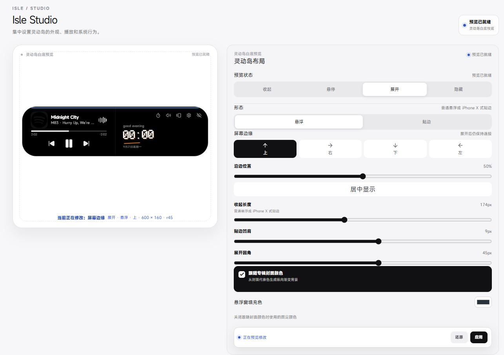
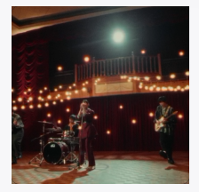

<div align="center">


# Isle

**让 Windows 的媒体状态，以一座灵动岛自然浮现。**

[简体中文](README.md) · [English](README.en.md) · [日本語](README.ja.md)

[](https://github.com/alent17/Wind0ws_Dynamic_island/releases/tag/v1.0.0)
[](https://github.com/alent17/Wind0ws_Dynamic_island/releases/latest)
[](https://tauri.app/)
[](LICENSE)

[下载 v1.0.0](https://github.com/alent17/Wind0ws_Dynamic_island/releases/tag/v1.0.0) · [安装指南](INSTALL.md) · [报告问题](https://github.com/alent17/Wind0ws_Dynamic_island/issues)

</div>

---

Isle 是面向 Windows 10/11 的桌面灵动岛与悬浮音乐播放器。它通过 Windows 系统媒体会话读取曲目、播放状态和时间线，以轻量、常驻、可定制的界面连接你的音乐与桌面。



## 亮点

- **系统媒体控制**：自动连接支持 SMTC 的播放器，支持播放、暂停、上一首、下一首与进度跳转。
- **灵动岛交互**：收起、悬停、展开与自动隐藏；支持四向贴边、位置与尺寸调整。
- **实时音频频谱**：系统音频 FFT 或平滑随机动画，暂停时自然回落。
- **高清封面与悬浮播放器**：智能补全清晰封面；独立播放器与主岛共享曲目、播放状态和时间线。
- **空闲信息面板**：日期、天气、网速、CPU、内存、电池和自定义文字轮播。
- **快捷工具**：系统音量、输出设备切换、倒计时、临时隐藏与设置入口。
- **捕获隐私**：针对截图、录屏、全屏游戏和屏幕共享分别配置隐藏行为。
- **三语界面**：简体中文、English、日本語，可跟随系统或手动切换。
- **Windows 集成**：多显示器、始终置顶、开机启动与系统托盘。

## 悬浮播放器

悬浮播放器提供独立于灵动岛的沉浸式媒体视图，可从 Isle Studio 或灵动岛快捷按钮打开。

- 自由拖动并调整窗口尺寸，紧凑与大尺寸布局会自动适配。
- 播放、暂停、上一首、下一首及进度显示与主岛实时同步。
- 优先展示高清专辑封面；启用 MV 功能后，可静音循环播放匹配到的 30 秒预览片段。
- 背景可跟随封面代表色生成渐变，也可使用自定义固定颜色。
- 支持始终置顶、关闭、位置复位，以及截图、录屏和屏幕共享捕获保护。

## 界面预览

| 悬浮播放器 | 媒体画面 |
|:--:|:--:|
|  |  |

## 安装

1. 从 [GitHub Releases](https://github.com/alent17/Wind0ws_Dynamic_island/releases/latest) 下载 `Isle_1.0.0_x64-setup.exe`。
2. 运行安装程序；Windows 首次运行时可能显示 SmartScreen 提示。
3. 播放任意支持 Windows 系统媒体控制的音乐，然后从系统托盘打开 Isle Studio 完成个性化设置。

系统要求：Windows 10/11 x64 与 Microsoft Edge WebView2 Runtime。完整升级与故障排查见 [INSTALL.md](INSTALL.md)。

## 使用

点击灵动岛展开或收起；展开后可控制媒体和拖动进度。右键系统托盘图标可打开 Isle Studio、悬浮播放器或完全退出。关闭应用窗口后程序可能仍驻留托盘。

不同播放器公开给 Windows SMTC 的能力不完全一致；直播流或部分浏览器可能不提供准确时长和进度跳转。

## 开发与构建

需要 Node.js 18+、Rust stable、Visual Studio 2022 Build Tools（“使用 C++ 的桌面开发”）。

```powershell
npm install
npm run check
npm test -- --run
cargo test --manifest-path src-tauri/Cargo.toml
npm run bundle:windows
```

技术栈：Tauri 2、Svelte 5、TypeScript、Vite、Rust、Windows API / SMTC、CPAL、RustFFT、Vitest。安装包输出到 `src-tauri/target/release/bundle/nsis/`。

## 隐私与网络

媒体控制在本机完成。天气功能使用 Open-Meteo；高清封面可能访问 Apple iTunes Search API 与网易云音乐现有免鉴权端点。Isle 不申请 Windows 定位权限，只保存你主动选择的地点及经纬度。第三方服务不可用时会尽量回退到系统媒体数据。

## 贡献

欢迎提交 Issue 与 Pull Request。提交前请运行前端检查、前端测试和 Rust 测试，并不要提交缓存、构建产物或个人配置。

**贡献者**：[@alent17](https://github.com/alent17) · [ChatGPT](https://chatgpt.com/)

## 许可证

本项目使用 [MIT License](LICENSE)。
