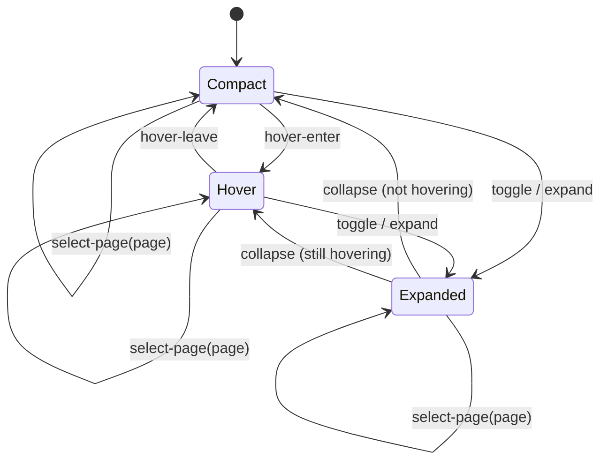

# Island state and transitions

`src/lib/islandStore.ts` is the main island's interaction-state boundary.
Components should send named events through `transitionIsland` rather than
mutating expanded, hover, or page state independently.

## Current state

```ts
interface IslandState {
  expanded: boolean;
  hovering: boolean;
  activePage: "music" | "timer" | "volume" | "clock" | "weather";
}
```

The rendered geometry mode is derived from the interaction state:

| Condition | Geometry mode |
|---|---|
| `expanded` | `expanded` |
| otherwise `hovering` | `hover` |
| otherwise | `compact` |

Capture hiding is currently coordinated by `App.svelte` and window placement;
it is not a persistent island-store mode. Media availability, playback data,
countdown data, and system audio are also maintained by their owning app/service
flows rather than the interaction store.

## Events

| Event | State change |
|---|---|
| `toggle` | Flip `expanded` |
| `expand` | Set `expanded` to true; safe to repeat |
| `collapse` | Set `expanded` to false; safe to repeat |
| `hover-enter` | Set `hovering` to true |
| `hover-leave` | Set `hovering` to false |
| `select-page(page)` | Select music, timer, volume, clock, or weather |

Repeating an event that already matches the state returns the existing object,
which avoids needless store notifications. Hiding the island first collapses and
clears hover before the native window moves off-screen.

## Current transition map



Page selection is an orthogonal state value, so selecting Timer or Volume does
not implicitly change the shape mode. Timer completion expands the island;
pointer movement and the close timeout can subsequently change the geometry
mode.

## Remaining state-machine work

- Move idle/media availability and active tool selection into the shared model
  where that removes duplicate ownership.
- Decide whether capture-hidden should become an explicit state or remain an
  external visibility policy; avoid conflating off-screen placement with UI
  geometry.
- Migrate remaining page/tool state from `App.svelte` only when each consumer
  can use the store without duplicating authoritative media/audio/timer data.
- Verify rapid hover and timer-completion sequences on the running Windows app.
