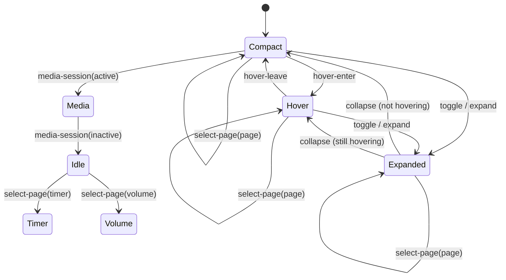

# Island state and transitions

`src/lib/islandStore.ts` is the main island's interaction-state boundary.
Components should send named events through `transitionIsland` rather than
mutating expanded, hover, or page state independently.

## Current state

```ts
interface IslandState {
  expanded: boolean;
  hovering: boolean;
  activePage: "music" | "timer" | "volume" | "clock" | "weather";
  hasMediaSession: boolean;
}
```

The rendered geometry mode is derived from the interaction state:

| Condition | Geometry mode |
|---|---|
| `expanded` | `expanded` |
| otherwise `hovering` | `hover` |
| otherwise | `compact` |

The semantic view is derived separately so expanded geometry retains the
selected page. Outside expanded mode, Timer, Volume, Clock, and Weather pages
select their matching view; the Music page selects Media when a session exists
and Idle otherwise. Capture hiding is coordinated by `App.svelte` and window
placement and is not a persistent island-store mode. Playback details,
countdown data, and system audio stay with their owning app/service flows.

## Events

| Event | State change |
|---|---|
| `toggle` | Flip `expanded` |
| `expand` | Set `expanded` to true; safe to repeat |
| `collapse` | Set `expanded` to false; safe to repeat |
| `hover-enter` | Set `hovering` to true |
| `hover-leave` | Set `hovering` to false |
| `media-session(active)` | Record whether the media backend has a current session |
| `select-page(page)` | Select music, timer, volume, clock, or weather |

Repeating an event that already matches the state returns the existing object,
which avoids needless store notifications. Hiding the island first collapses and
clears hover before the native window moves off-screen.

## Current transition map



Page selection is an orthogonal state value, so selecting Timer or Volume does
not implicitly change the shape mode. Timer completion expands the island;
pointer movement and the close timeout can subsequently change the geometry
mode.

## Remaining state-machine work

- Add explicit countdown-running and active-tool state when that removes
  duplicate ownership; countdown data itself remains with its current timer
  lifecycle.
- Decide whether capture-hidden should become an explicit state or remain an
  external visibility policy; avoid conflating off-screen placement with UI
  geometry.
- Migrate remaining page/tool state from `App.svelte` only when each consumer
  can use the store without duplicating authoritative media/audio/timer data.
- Verify rapid hover and timer-completion sequences on the running Windows app.
