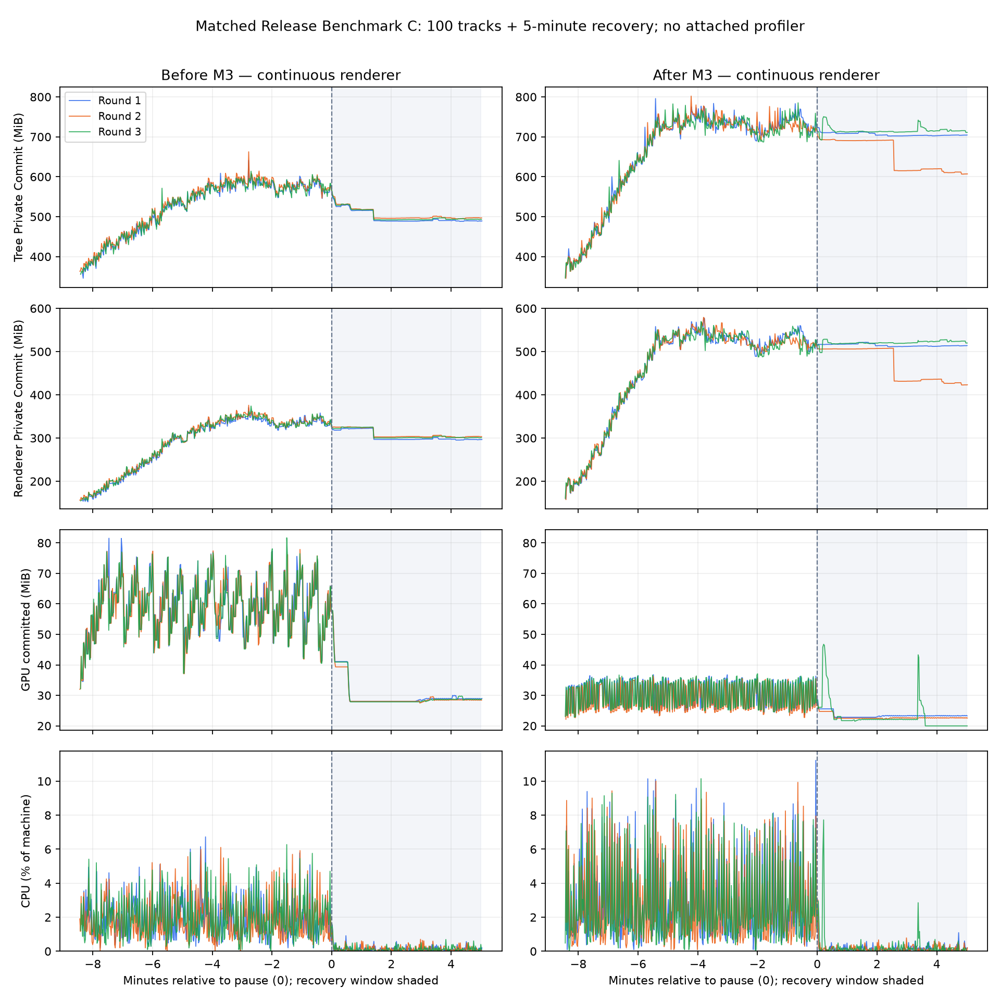

# M3 Release Benchmark C：收益与回归

**六轮正式对照完成，M3 保持 `[ ]`。** 两侧包含相同 M2 修复与测量适配器；唯一业务差异是 M3 资源预算。三轮中位数表明下载缓冲、Canvas backing 和 GPU 峰值下降，但进程树 Private Commit、Renderer 内存和 CPU 明显回归，不能把本次实现验收为整体内存优化。M2 的既有封面状态/生命周期验收不因此撤销；其他阶段不动。

## 正式结果

以下峰值取连续切歌段，缓冲探针取应用生命周期内的已跟踪高水位，恢复值单列。包含恢复段的 GPU 峰值也已记录：优化后第 3 轮出现 46.75 MiB 短峰，高于其连续段 37.08 MiB；前后完整采样 GPU 峰值的三轮中位数仍为 81.54 → 36.79 MiB。

- 进程树 Private Commit 峰值：640.99 → 795.94 MiB，**+24.17%**。
- Renderer Private Commit 峰值：374.18 → 578.30 MiB，**+54.55%**。
- GPU committed 峰值：81.54 → 36.79 MiB，**−54.88%**。
- 切歌期间 CPU 平均值：整机 1.91% → 2.75%，增加 **0.83 个百分点 / +43.54%**；CPU P95 增加约 80%。
- 恢复末分钟 Renderer Commit：301.29 → 513.45 MiB，**+70.42%**。
- 已跟踪下载缓冲峰值：10,053,192 → 196,608 bytes，**−98.04%**；主封面 Canvas backing 中位数：5,760,000 → 135,424 bytes，**−97.65%**。
- 首次绘制延迟中位数：639.5 → 611.5 ms；末次绘制延迟：885.5 → 903.0 ms。首次/末次绘制 P95 基本相同；这里测的是 draw-complete 记录抵达原生的时间，不是屏幕实际呈现帧时。

完整逐轮与中位数表见 [METRICS.md](METRICS.md)，机器可读数据见 [comparison.json](comparison.json)。三轮重复均显示优化后的进程树/Renderer Commit 更高；优化后第 2 轮恢复阶段出现较大释放，其余两轮仍保留较高 Commit，不能用该单轮释放证明长期稳定。

阴影部分为保持浮窗打开、暂停播放器后的 5 分钟。GPU 峰值降低是本场景观测到的收益，**GPU 长期回稳仍未证实**。曲线中的后续波动不直接归因为泄漏；本轮也不代表 B0 Idle 已达标。

## 配对与有效性

正式组只采用重启后的 `runs-session2/`：前1、后1、后2、前2、前3、后3，各连续切换固定 100 首，再恢复 300 秒。每轮全新 Isle 缓存和 WebView profile、预热 60 秒；DPI=1、浮窗 200×395、HD 开、像素化/MV 关，其余共享设置一致。正式轮没有附加 CDP/HeapProfiler，也没有强制 GC。

六轮均完成 100 首，Renderer PID 集合在各自连续场景中保持不变。每首末次绘制的自然图片尺寸均匹配固定语料，避免把无图/缩略图误算作 HD 内存收益。语料含一首例外：《Body》HD 链接返回 404，两侧同用真实 108×108 SMTC 缩略图，单列 HD 不可用。

封面与附带元数据使用同一个不可变 HTTP 回放服务；它保留两版自己的下载、解码、缓存与 Canvas 路径，隔离在线服务抖动，不代表真实在线服务延迟。六轮各有全部 101 份完整长度/哈希观测，完整观测跨轮一致。回放按索引区分 101 个 URL 键；原提供方只有 98 个不同 URL、素材有 94 个不同 SHA-256。该条件对两侧相同，但不保留少数原 URL 跨歌曲复用的命中，绝对内存值不能直接外推普通在线播放。

**文件探针限制：** 优化前的 `download-input` 探针实际上读取已保存的共享缓存文件。并发写同一文件时共出现 15 次短读（前1/前2/前3：4/6/5；优化后为 0），包括一次零长度。这些是缓存文件竞争观测，不能称为不同的 HTTP 输入。它们完整保留在汇总中，没有悄悄删除；只有长度匹配冻结清单的完整观测用于跨轮哈希核对。素材服务始终回放固定字节，100 首最终图片尺寸均正确。不能把短读次数直接当作用户可见错图次数。

构建、源码、二进制及语料哈希见 [build-manifest.json](build-manifest.json)、[before-source-hashes.json](before-source-hashes.json)、[after-source-hashes.json](after-source-hashes.json)。过程及废弃批次见 [PROTOCOL.md](PROTOCOL.md)。完整原始采样、事件、二进制、素材与私有原队列备份保留在本地 `dist/performance/m3-release-c-2026-10-09/`。

## 独立诊断

连续 Renderer、每 25 首关闭重开、实际显示质量与 Detached Canvas 诊断均已完成；这些数据不加入正式性能中位数。最终连续/画质诊断采用固定指针的 `diagnostic-hover-fixed/`，重开回归采用 `diagnostic/`；未控制悬停的旧截图不参与质量结论。

| 版本 / 场景 | 真实切歌 | 关闭重开 | 快照检查点 | Detached Canvas | 页面错误 |
| --- | ---: | ---: | --- | ---: | ---: |
| 前 / 连续浮窗 | 100 | 0 | 0、25、50、75、100 | 各点 0 | 0 |
| 后 / 连续浮窗 | 100 | 0 | 0、25、50、75、100 | 各点 0 | 0 |
| 前 / 每 25 首重开 | 100 | 4 | 0、25、50、75、100 | 各点 0 | 0 |
| 后 / 每 25 首重开 | 100 | 4 | 0、25、50、75、100 | 各点 0 | 0 |

四个诊断场景中，每首均通过当前曲目、单一连接 Canvas、非空 backing、图片就绪及像素/截图相似性检查，重开后同曲目封面正常。没有检测到错图/空白或 Detached Canvas；这是本次检查范围内的结果，不能证明所有竞态都不存在。本轮没有重跑真实无会话恢复，该项沿用独立 [M2 验收](../m2-reopen-2026-10-08/ACCEPTANCE.md)。详细堆指标见 [diagnostic-summary.json](diagnostic-summary.json)。

缓存 asset 图片使 Canvas 的直接 `getImageData` 受到浏览器跨源限制。诊断保留该限制，用实际 CSS 尺寸截图与浏览器绘制的源图参考进行比较；不关闭安全检查、不改变业务图片加载。截图对照采用三点精确容差或内部区域 RMS≤8 RGB levels 的判定，并记录误差，容纳 compositor 与参考的缩放采样差异。实际前后质量误差另列，不能只用“存在 Canvas”判定显示正确。

**画质存在变化，不能宣称完全无回归。** 100 对实际显示源图统一解码至 180×180 后，10 对逐像素一致，最差 MSE=10.75、PSNR≈37.82 dB。100 对实际 Canvas 显示截图均为 184×185，但没有逐像素相同的一对：MSE 中位数 88.03，最大 1,412.39（对应 PSNR≈16.63 dB）。这是两版差异指标，不是相对理想参考的质量分数；不能仅凭 PSNR 判定哪版更好。检查差异最大的三个样本可见细线、小字/纹理的重采样软化，源图误差小并不能排除显示细节变化。1× DPI 的结果也不能替代 1.5×/2× DPI 验收。

| 差异较大样本 | 优化前实际显示 | 优化后实际显示 |
| --- | --- | --- |
| 81 · こいのうた |  |  |
| 49 · 未定 |  |  |
| 70 · ポルターガイスト |  |  |

逐首指标见 [quality-comparison.json](quality-comparison.json)。完整 100 对截图与显示源字节保留本地，发布三组用于检查；它们来自独立诊断，没有混入正式 CPU/内存轮。

## 结论边界与后续

原生缓冲探针仅覆盖声明的已知分配，不包含 decoder scratch、HTTP 内部缓冲或 WebView 图片解码。优化前原生解码计数为 0 是此配置未进入被跟踪的原生解码分支，**不代表没有解码成本**；优化后标准化缓存进入该分支，计数为 5,760,000 bytes。编码输入计数两侧为 0，同样不能解释为真实编码/图片分配为 0。

从实现可见，优化后把封面规范化为 PNG，增加原生解码/编码工作，且缓存图片往往比原 JPEG 大；这与 CPU/Renderer 回归一致，是后续应验证的候选原因，**本轮没有通过 retained-image/allocator 归因证明根因**。不得把这一推测写成已确认泄漏。

应用退出后，三轮各自的磁盘媒体文件总量一致：优化前 101 个文件 / 71.25 MiB（91 JPEG、10 PNG），优化后 79 个 PNG / 126.79 MiB。优化后的磁盘缓存符合其 128 MiB 限额并发生了淘汰，但 Renderer Commit 仍更高，证明不能只用磁盘配额验收运行时内存。该统计是退出后的文件量，不是运行峰值，见 [cache-final.json](cache-final.json)。

本轮完成对照并记录回归，不继续修改 PNG 格式、解码策略、动画、UI 或 M4 等阶段。M3 保持未勾选；下一次若修正其处理/编码路径，应复用同一 M2、同一冻结语料和相同条件重新验收。GPU 长期稳定、其他 DPI/像素化场景和实际呈现帧时均不能由本轮代替。

两侧 Release 构建成功；本轮新增/变更测量工具通过 Node、Python、PowerShell 语法检查，共用 M2/适配器/Cargo 文件与二进制哈希重新核对。没有重复把以前的业务测试通过数当作本次性能验收。
